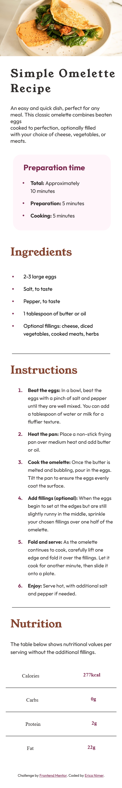

# Frontend Mentor - Recipe page

## Table of contents

- [Overview](#overview)
  - [The challenge](#the-challenge)
  - [Screenshot](#screenshot)
  - [Links](#links)
- [My process](#my-process)
  - [Built with](#built-with)
  - [What I learned](#what-i-learned)
  - [Continued development](#continued-development)

## Overview

This project is a solution to the Recipe page challenge on Frontend Mentor. The challenge was to create a responsive recipe page using HTML and CSS.

I focused on implementing clean and semantic HTML5 markup along with CSS Grid and Flexbox for layout and styling. Additionally, I utilized a mobile-first approach to ensure a seamless experience across various devices.

Overall, this project allowed me to sharpen my front-end development skills while tackling a real-world design challenge.

### Screenshot



### Links

- Live Site URL: [https://recipe-page-frontend-mentor-challenge.vercel.app/]

## My process

Developing the recipe page challenge was a journey guided by my vision and passion for programming. With a final design in hand, courtesy of Frontend Mentor, I immersed myself in the process of turning the idea into reality.

- Starting Point:

The final design provided by Frontend Mentor served as my starting point.

- Creative Implementation:

Despite having a ready-made design, implementation demanded creativity and technical skill. I adjusted the code to ensure that every detail of the design was accurately reproduced while keeping the user experience in mind.

- Testing and Refining:

As the project came to life, frequent tests were conducted to ensure functionality and responsiveness across different devices. With each tweak, the challenge came closer to the desired final result.

- Launch to the Community:

With the challenge completed, it was exciting to share it with the GitHub community. Not only is it a safe place to showcase my projects, but I can also track my programming development.

 - Reflection and Learning:

After the launch, I took time to reflect on the process. Identifying strengths and areas for improvement helped me grow as a developer and enhance my skills for future challenges.

Creating the recipe page challenge was a challenging yet incredibly rewarding journey. It was an opportunity to showcase my skills, learn from the experience, and contribute to the developer community.

### Built with

- Semantic HTML5 markup
- CSS custom properties
- Flexbox
- CSS Grid
- Mobile-first workflow

### What I learned

Even though I already had knowledge of HTML5 and CSS, I had the opportunity to refresh my memory on the "ol" tag for creating ordered lists. As you can see, in the instructions section, I needed a numbered ordered list, but I only knew the "ul" tag for creating lists.

Since this is my first time creating a responsive page, I didn't know how to use and when to use the "vw" unit of measurement. But since the project's focus was on being responsive, this unit of measurement came in handy. Because the content adapts to the width of the client's device screen.


```html

  <ol>
      <li><span class="instrictions__bold">Beat the eggs:</span><span class="instrictions__color"> In a bowl, beat the</br>eggs with a pinch of salt and pepper</br>until they are well mixed. 
      You can add</br>a tablespoon of water or milk for a</br>fluffier texture.</span></l1>
      <li><span class="instrictions__bold">Heat the pan:</span><span class="instrictions__color"> Place a non-stick frying</br>pan over medium heat and add butter</br>or oil.</span></l1>
      <li><span class="instrictions__bold">Cook the omelette:</span><span class="instrictions__color"> Once the butter is</br>melted and bubbling, pour in the eggs.</br> Tilt the pan to ensure the eggs evenly</br>coat the surface.</span></l1>
      <li><span class="instrictions__bold">Add fillings (optional):</span><span class="instrictions__color"> When the eggs</br>begin to set at the edges but are still</br>slightly runny in the middle, sprinkle</br>your chosen fillings over one half of the omelette.</span></l1>
      <li><span class="instrictions__bold">Fold and serve:</span><span class="instrictions__color"> As the omelette</br>continues to cook, carefully lift one</br>edge and fold it over the fillings. Let it</br>cook for another minute, then slide it</br>onto a plate.</span></l1>
      <li><span class="instrictions__bold">Enjoy:</span><span class="instrictions__color"> Serve hot, with additional salt</br>and pepper if needed.</span></l1>
  </ol>

```
```css
  .omelette__img{
    width: 100vw;
  }
```

### Continued development

After completing the project, I realized that I want and will focus more on CSS because it still takes up a lot of my time. I need to improve my CSS skills for making a page responsive. And in the near future, I plan to learn the JavaScript programming language, as well as some CSS and JavaScript frameworks, SQL database, PHP for backend, or perhaps Node.js.

I have a long way to go, and looking back at my old repositories in the future will be fun and rewarding, seeing the journey I've had to become a programmer.

### Thanks!

I would like to say thank you if you saw my project and read this README.
Feel free to share your opinions about this project or maybe some tips to improve my learning process.

Thank you!


### Author

Developed by Erica Nimer.


